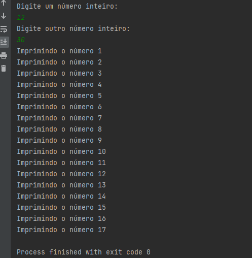
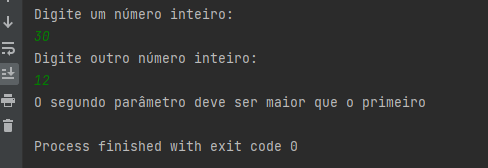

# Desafio Controle de Fluxo
***
### Introdução

Este sistema foi desenvolvido como desafio do Bootcamp Java da DIO.

O programa recebe dois números inteiros digitados pelo usuário, sendo que o primeiro número digitado não poderá ser superior
ao segundo, caso ocorra o sistema apresenta uma mensagem para
que o usuário digite novamente.
Estando tudo certo o programa imprime 
na tela a frase "Imprimindo o número 1", "Imprimindo o numero 2"
e assim sequencialmente de acordo com a quantidade de números 
entre os digitados.

***

### Mecânica

Para rodar o programa será necessário instalar no seu computador
o Java, JDK e também alguma IDE da sua preferência, sugiro o IntelliJ Community.

***

### Imagem do programa com êxito

### Imagem do programa com mensagem de correção

